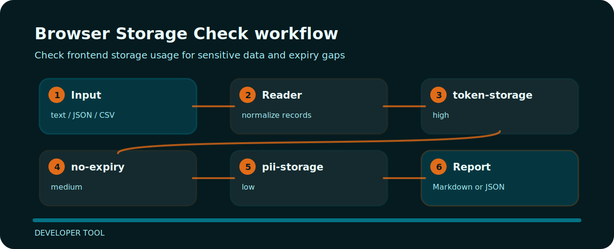

# Browser Storage Check


Check frontend storage usage for sensitive data and expiry gaps.

## Before the fix

```text
risky: localStorage token expiry none pii true
clean: sessionStorage nonce expiry 15m pii false
```

## Review notes

| Signal | Level | What it flags | Fix direction |
| --- | --- | --- | --- |
| `token-storage` | high | token stored in localStorage | use secure cookie or safer storage |
| `no-expiry` | medium | expiry missing | define expiry |
| `pii-storage` | low | PII stored client-side | minimize and protect stored data |

## Finding map



## Try the fixture

```bash
git clone https://github.com/mertefekurt/browser-storage-check.git
cd browser-storage-check
python -m pip install -e ".[dev]"
browser-storage-check examples/sample.txt
```
